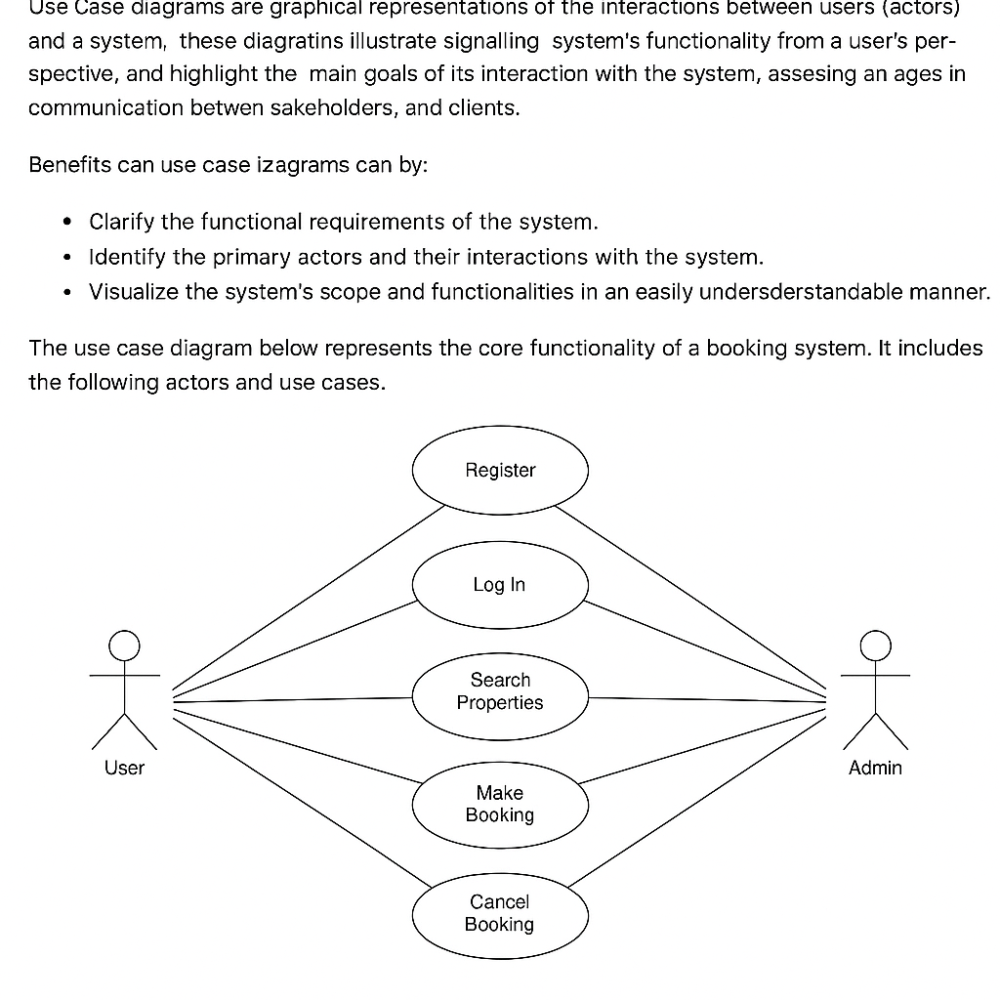

# Requirement Analysis in Software Development

## Introduction

This repository is designed to enhance a professional developer’s ability to master the principles and methodologies of **Requirement Analysis** within the Software Development Life Cycle (SDLC). The project focuses on efficiently translating project needs into structured documentation while identifying and categorizing both functional and non-functional requirements for scalable systems.

Key objectives of this repository include:
- Mastering the principles of Requirement Analysis in the SDLC.
- Creating clear, structured documentation to meet project needs.
- Identifying and categorizing functional and non-functional requirements for scalable systems.
- Leveraging tools like **Draw.io** for visual representation of system requirements.
- Establishing clear **acceptance criteria** to ensure alignment with business and user goals.
- Applying best practices to produce industry-standard documentation and diagrams.

Whether you are enhancing your skills as a developer or improving your project management capabilities, this repository provides valuable resources for effective requirement gathering, documentation, and visualization.

## What is Requirement Analysis?

**Requirement Analysis** is a critical phase in the Software Development Life Cycle (SDLC) that involves understanding and documenting the needs and expectations of stakeholders for a software project. This process aims to clearly define the functionalities and constraints of the software, ensuring that the development team builds a system that meets both business goals and user needs.

During Requirement Analysis, various stakeholders, such as clients, users, business analysts, and developers, collaborate to identify and articulate the requirements for the system. These requirements are divided into two main categories:
- **Functional Requirements:** Describes the specific behavior or functions of the system (e.g., user authentication, data processing).
- **Non-Functional Requirements:** Specifies the performance, security, scalability, and other system characteristics (e.g., system uptime, response time).

The primary purpose of Requirement Analysis is to create a foundation for system design and development. It serves as the bridge between what stakeholders expect from the software and how those expectations will be implemented. Proper requirement analysis helps:
- Minimize misunderstandings between stakeholders and developers.
- Prevent costly changes or scope creep during later stages of development.
- Ensure the final product aligns with business objectives and user needs.

Requirement Analysis plays a vital role in the success of a software project as it ensures the right features are built from the beginning, avoids unnecessary work, and keeps the project on track in terms of time, budget, and quality.

## Why is Requirement Analysis Important?

Requirement Analysis is a cornerstone in the Software Development Life Cycle (SDLC). Its significance can be understood through several key reasons:

1. **Ensures Alignment with Business Goals:**
   Properly conducted requirement analysis ensures that the software being developed aligns closely with the business objectives. By clearly identifying stakeholder needs and expectations, development teams can create software that solves real business problems and meets organizational goals.

2. **Reduces Risk of Scope Creep:**
   Without clear requirements, a project is vulnerable to scope creep—when additional features or changes are requested after the project has started, often leading to delays and budget overruns. Requirement Analysis helps to define what is in scope and what is out of scope from the outset, keeping the project on track and reducing unexpected changes.

3. **Improves Communication and Collaboration:**
   Requirement Analysis fosters better communication among stakeholders, business analysts, and developers. It encourages collaboration through activities like interviews, surveys, and workshops, helping to ensure everyone has a clear understanding of the software's expected functionality and performance. This leads to fewer misunderstandings and greater alignment throughout the project lifecycle.

By addressing these crucial aspects early in the SDLC, Requirement Analysis helps ensure that software projects are delivered on time, within budget, and meet user expectations.

## Key Activities in Requirement Analysis

Requirement Analysis involves several key activities that help to identify, clarify, document, and validate the requirements for a software project. Below are the key activities:

- **Requirement Gathering:**
   - The initial phase where stakeholders (such as clients, users, and business analysts) provide their expectations and needs for the software. 
   - This activity involves collecting all necessary data through interviews, surveys, workshops, or any other method that helps to understand what the stakeholders want the system to achieve.

- **Requirement Elicitation:**
   - The process of refining and elaborating the requirements gathered during the initial phase.
   - It involves using techniques like brainstorming, prototyping, or observation to obtain further details and ensure that the requirements are clear and well-defined.

- **Requirement Documentation:**
   - The process of documenting all the requirements clearly and concisely.
   - This includes creating formal documents like requirement specifications, user stories, and use cases. It ensures that all stakeholders have a shared understanding of the project’s scope and expectations.

- **Requirement Analysis and Modeling:**
   - After gathering and documenting requirements, this activity focuses on analyzing the data to identify any inconsistencies or gaps.
   - It includes creating models or diagrams (like use case diagrams, flowcharts, and data models) to visualize how the system will behave and how it will interact with users or other systems.

- **Requirement Validation:**
   - This phase involves reviewing and validating the requirements with stakeholders to ensure they accurately reflect their needs.
   - Validation activities include checking if the requirements are feasible, realistic, and aligned with the business objectives. It ensures that the project scope is clear and achievable before moving into the design and development phases.

## Types of Requirements

### Functional Requirements

**Functional Requirements** define the specific behaviors, features, and functions of a system. These requirements focus on what the system should do in terms of actions, processes, or interactions.

#### Examples for the Booking Management Project:
- **User Registration and Authentication:**
   - The system should allow users to create an account and authenticate via a username and password.
   - Users should be able to reset their password through email verification.
  
- **Booking Process:**
   - Users should be able to search for available properties based on specific criteria (e.g., location, price, property type).
   - The system should allow users to book a property by selecting available dates and submitting payment details.
   
- **Booking Management:**
   - Users should be able to view, modify, or cancel their existing bookings.
   - The system should send email notifications confirming successful bookings or cancellations.

- **Payment Integration:**
   - The system should securely integrate with payment gateways to process booking payments.

### Non-Functional Requirements

**Non-functional Requirements** specify the performance, security, and quality attributes that a system must meet. These requirements focus on *how* the system performs under certain conditions.

#### Examples for the Booking Management Project:
- **Performance:**
   - The system should load the property search results within 2 seconds, even under heavy load.
   
- **Scalability:**
   - The system should be able to handle at least 10,000 concurrent users without significant performance degradation.

- **Security:**
   - The system should use encryption protocols (e.g., TLS) for all sensitive data, including passwords and payment details.
   - Users should be required to use strong passwords (e.g., minimum 8 characters, with at least one number and one special character).

- **Availability:**
   - The system should have 99.9% uptime, excluding scheduled maintenance windows.

- **Usability:**
   - The system should have an intuitive user interface with clear navigation, so that users can book properties in fewer than 5 steps.

---

## Use Case Diagrams

**Use Case Diagrams** are a type of diagram used in the requirement analysis phase to visually represent the interactions between users (or other systems) and the software system. They depict the system’s functionality from the user's perspective and identify the primary goals of the system.

### What Are Use Case Diagrams?

Use Case Diagrams are used to capture the functional requirements of a system by showing how different users (actors) interact with the system and what actions they can perform. Each "use case" in the diagram represents a specific functionality that the system provides. The actors can be either human users or other systems that interact with the software.

A Use Case Diagram typically includes:
- **Actors:** Represent users or other systems that interact with the system.
- **Use Cases:** Represent the various functionalities or processes that the system performs.
- **Associations:** Indicate the interactions between actors and use cases.

### Benefits of Use Case Diagrams

1. **Clarifies System Requirements:**
   Use Case Diagrams provide a clear and simple way to visualize the functionalities of the system, helping stakeholders understand how users will interact with it.

2. **Improves Communication:**
   By depicting interactions in a visual format, Use Case Diagrams facilitate better communication between developers, stakeholders, and users. They help ensure that everyone has a shared understanding of the system’s capabilities.

3. **Defines System Boundaries:**
   Use Case Diagrams help identify the scope of the system, highlighting which features are included and which are excluded, thus helping in avoiding scope creep.

4. **Serves as a Foundation for Further Analysis:**
   Once the basic use cases are defined, they can be expanded into detailed use case specifications, providing a solid foundation for further analysis, design, and implementation.

5. **Supports Test Planning:**
   Use cases can be used to identify test scenarios for verifying the functionality of the system, helping in ensuring that all the critical use cases are properly tested.

By using Use Case Diagrams, teams can more effectively plan, design, and communicate the expected functionality of the system, leading to smoother development and fewer misunderstandings.

## Acceptance Criteria

**Acceptance Criteria** are a set of predefined conditions or requirements that a software product must meet in order to be considered complete and acceptable by the stakeholders, including business owners, users, and developers. These criteria are typically outlined during the requirement analysis phase and are critical in ensuring that the system delivers the desired functionality and meets business goals.

### Importance of Acceptance Criteria in Requirement Analysis:

1. **Clear Expectations:** Acceptance criteria provide clear and unambiguous definitions of what needs to be done. This clarity helps both the development team and the stakeholders to have a mutual understanding of the feature being developed and the end goal.

2. **Scope Management:** Acceptance criteria help to define the boundaries of a feature, which prevents scope creep. By detailing what is in scope and what is not, they ensure that only the agreed-upon functionality is delivered.

3. **Validation and Verification:** Acceptance criteria serve as a basis for testing the functionality of a system. They help to verify that the software meets the requirements and performs as expected. They also define the specific conditions under which the feature is considered complete.

4. **Quality Assurance:** By having predefined criteria, acceptance criteria aid the quality assurance (QA) team in creating test cases and ensuring that the feature is thoroughly tested. This results in fewer defects and higher quality software.

5. **Stakeholder Confidence:** Acceptance criteria allow stakeholders to know exactly what to expect from the feature and help ensure that their needs are met. This leads to greater confidence in the product.

### Example of Acceptance Criteria: Checkout Feature in Booking Management System

For the **Checkout** feature in a booking management system, the acceptance criteria might look like the following:

- **User Login and Authentication:**
   - The user must be logged in to proceed with the checkout.
   - The system should verify the user’s identity using the stored username and password.

- **Payment Information:**
   - The user must provide valid payment details (credit/debit card, PayPal, etc.) before proceeding.
   - The system must securely process payment details using an integrated payment gateway.
   - The payment process should be completed within 5 seconds.

- **Booking Confirmation:**
   - Upon successful payment, the user should receive an email confirming their booking.
   - The booking confirmation should include the property details, booking dates, and payment amount.

- **Error Handling:**
   - If the payment fails, the user must see an error message explaining the failure (e.g., “Insufficient funds” or “Payment method declined”).
   - The user should be able to retry with a different payment method or update their payment details.

- **Booking Modification:**
   - Users should be able to modify the booking details (e.g., change dates) before the payment is processed.
   - Once payment is processed, changes to the booking should not be allowed without customer support intervention.

- **Performance:**
   - The checkout process should load within 3 seconds.
   - The system should handle at least 100 simultaneous checkouts without performance degradation.

